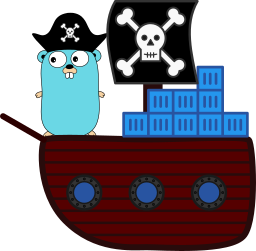

# go-pillage-registries ( pilreg )



This project takes a Docker registry and pillages the manifest and configuration for each image in its catalog.

It uses Google's [crane](https://github.com/google/go-containerregistry/blob/master/cmd/crane/doc/crane.md) command's package, which should follow docker's keychain semantics.
If you would like to override this, just change `authn.DefaultKeychain` as described in the <https://github.com/google/go-containerregistry/tree/master/pkg/authn/k8schain>

## Installation

```bash
git clone https://github.com/nccgroup/go-pillage-registries.git

cd go-pillage-registries
go install ./...

```

### Homebrew

If you maintain a Homebrew tap, copy `Formula/pilreg.rb` from this
repository into the `Formula` directory of your tap. Once pushed, users can
run:

```bash
brew tap antitree/pilreg
brew install pilreg
```

### Docker

If you prefer to run pilreg via Docker instead of installing a binary, you
can pull and run the official container image:

```bash
docker pull ghcr.io/antitree/go-pillage-registries:v2.0.0

docker run --rm ghcr.io/antitree/go-pillage-registries:v2.0.0 pilreg --help
```

## Usage:

```
Usage: pilreg <registry> | -l <tarbalpath> [OPTIONS]

pilreg is penetration testing tool targeting container images hosted in a registry or in a tar ball.
Examples:
  pilreg 127.0.0.1:5000 -a
  pilreg 127.0.0.1:5000 --repos nginx --tags latest,stable
  pilreg <registry> --repos <project>/<my image>:latest
  pilreg --local <path/to/tarball.tar> --whiteout
  pilreg --local <path/to/tarball.tar> --whiteout-filter=apk,tmp,test
  pilreg 
  pilreg <registry> --trufflehog

 Registry/Local config options:
  --repos	List of repositories to scan. If blank, uses the registry's catalog API.
  --tags	List of tags to scan per repository. If blank, uses the tags API.
  --local	Path to a local image tarball to scan.

 Storage config options:
  --output	Directory to store output. Required with --store-images.(./results/ by default)
  --store-images	Download and store image filesystems.
  --cache	Path to cache image layers. (/tmp by default)

 Analysis config options:
  --trufflehog	Scan image contents with TruffleHog.
  --whiteout	Look for deleted/whiteout files in image layers.
  --whiteout-filter     Filter patterns when extracting whiteouts. Defaults to 'tmp,cache,apk,apt'.
                        Files that are empty regular files are also skipped.

 Connection options:
  --skip-tls	Disable TLS verification.
  --insecure	Use HTTP instead of HTTPS.
  --token       Registry bearer token or password. If omitted, pilreg uses
                credentials from your local Docker configuration and logs
                the registry and a snippet of the credential in use.
  --username	Username for token auth
  --workers	Number of concurrent workers.

  --version	Print version information and exit.
  --debug	Enable debug logging.
```
If `--local` is not provided and the value for `<registry>` ends with a common tarball extension such as `.tar`, `.tar.gz`, or `.tgz`, `pilreg` will automatically switch to local mode and scan that file.

## Shell Autocomplete

To generate a shell completion script, invoke pilreg with `--autocomplete` and your shell name (bash, zsh, fish or powershell). For example:

```bash
# Bash:
pilreg --autocomplete bash > /etc/bash_completion.d/pilreg

# Zsh (Oh My Zsh):
pilreg --autocomplete zsh > ${fpath[1]}/_pilreg

# Fish:
pilreg --autocomplete fish | source

# PowerShell:
pilreg --autocomplete powershell > pilreg.ps1
```

## Example:

In the [examples directory](docs/examples/) there is a demo Dockerfile that builds an image
with hidden (whiteout) secrets for testing the `--whiteout` feature.

## Developer Setup

This project uses pre-commit hooks to enforce Go formatting, import grouping, and linting.
To enable these checks locally, first install the [pre-commit](https://pre-commit.com/) framework:

```bash
pip install pre-commit
```

Then install the Git hook scripts:

```bash
pre-commit install
```

To run all checks against all files (e.g. after first install):

```bash
pre-commit run --all-files
```

The configured hooks include:
- `gofmt` (with simplification via `-s`)
- `goimports` (organizes and groups imports according to the module path)
- `golangci-lint` (runs govet, staticcheck, errcheck, ineffassign, unused, and more)

These checks are also executed in CI to ensure consistent code quality.

## Acknowledgments
* Thanks to @jmakinen-ncc the original author of NCC Group's go-registry-pillage
* @jonjohnsonjr: For the idea around the whiteout file feature (and writing Crane)
